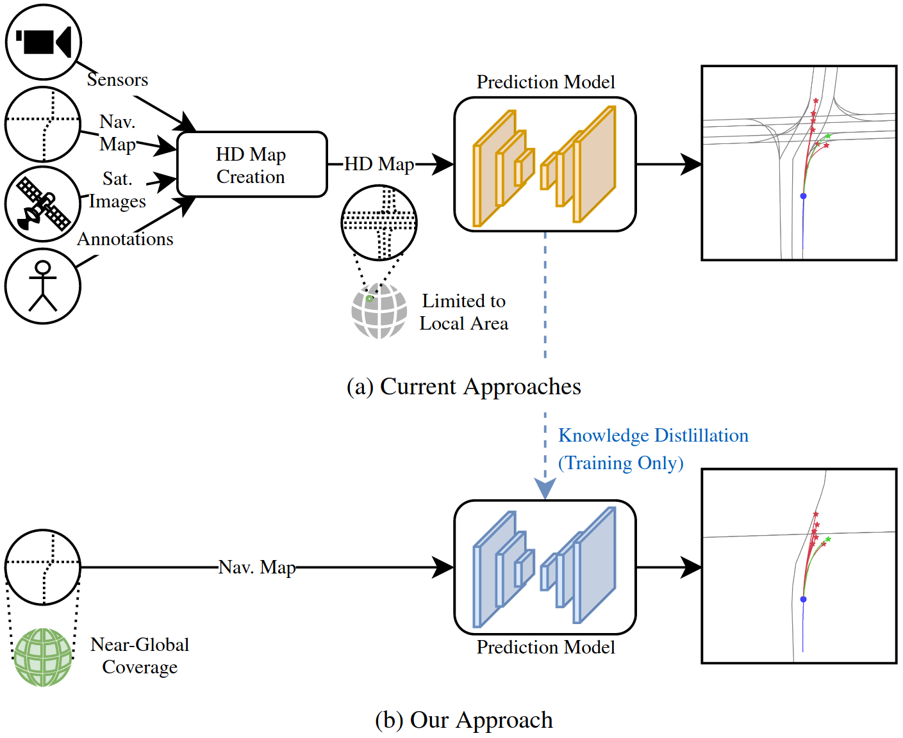

# Exploring Navigation Maps for Learning-Based Motion Prediction

Official repository of the paper:\
**[Exploring Navigation Maps for Learning-Based Motion Prediction](https://arxiv.org/abs/2302.06195)**\
Julian Schmidt, Julian Jordan, Franz Gritschneder, Thomas Monninger and Klaus Dietmayer\
Accepted at 2023 IEEE International Conference on Robotics and Automation (ICRA)



## Citation
If you use our source code, please cite:
```bibtex
@InProceedings{schmidt2023navmap,
  author={Julian Schmidt and Julian Jordan and Franz Gritschneder and Thomas Monninger and Klaus Dietmayer},
  booktitle={2023 IEEE International Conference on Robotics and Automation (ICRA)}, 
  title={Exploring Navigation Maps for Learning-Based Motion Prediction}, 
  year={2023},
  pages={3539--3545},}
```

## License
<a rel="license" href="http://creativecommons.org/licenses/by-nc/4.0/">
</a><br />The Argoverse Navigation Map API is licensed under <a rel="license" href="http://creativecommons.org/licenses/by-nc/4.0/"
 >Creative Commons Attribution-NonCommercial 4.0 International License</a>.
 
Check [LICENSE](LICENSE) for more information.

## Installation
### Install Anaconda
We recommend using Anaconda.
The installation is described on the following page:\
https://docs.anaconda.com/anaconda/install/linux/

### Install Required Packages
```sh
conda env create -f environment.yml
```

### Activate Environment
```sh
conda activate argoverse-navmap
```

## Basic Usage
### Initialize Navigation Map API
```python
from map_api import ArgoverseNavMap
navmap = ArgoverseNavMap()
```

### Plot Full Map
```python
navmap.plot_full_map("MIA")
```
### Query and Plot Specific Region
```python
roads = navmap.get_lane_ids_in_xy_bbox(600, 2000, "MIA", query_search_range_manhattan=100)
navmap.plot_lanes_by_id(roads, "MIA")
```

## Note
As described in the paper, the used navigation maps are at a road-level. Nevertheless, we have used the term "lane" instead of "road" throughout the source code. This provides consistency with the existing [HD map-reliant API from Argoverse](https://github.com/argoverse/argoverse-api/blob/master/argoverse/map_representation/map_api.py).

## Acknowledgement
We thank the authors of [OsmToRoadGraph](https://github.com/AndGem/OsmToRoadGraph), the library we used to obtain our navigation maps.
The data is provided by [OpenStreetMap](https://www.openstreetmap.org/#map=6/51.330/10.453).